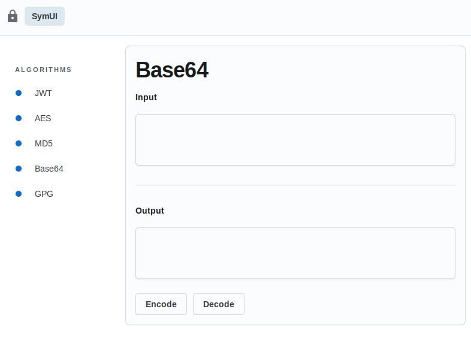

# Safe

Safe é um utilitário de ferramentas para desenvolvimento

## Início Rápido

```bash
git clone https://github.com/realfabecker/symui
cd symui
wails dev
```

## Screenshot



## Change log

Verifique o [CHANGELOG](CHANGELOG.md) para informações sobre alterações recentes.

## Contribuições

Refira-se ao guia de [contribuições](./docs/CONTRIBUTING.md) para detalhes de como contribuir para o projeto.

## Versionamento

O projeto utilizada [SemVer](https://semver.org/) para o versionamento. Para todas as versões disponíveis verifique as
[tags nesse repositório][project-link].

## Licença

Este projeto considera a licença MIT. Verifique a [Licença](LICENSE.md) para mais informações.

[project-link]: https://github.com/realfabecker/symui